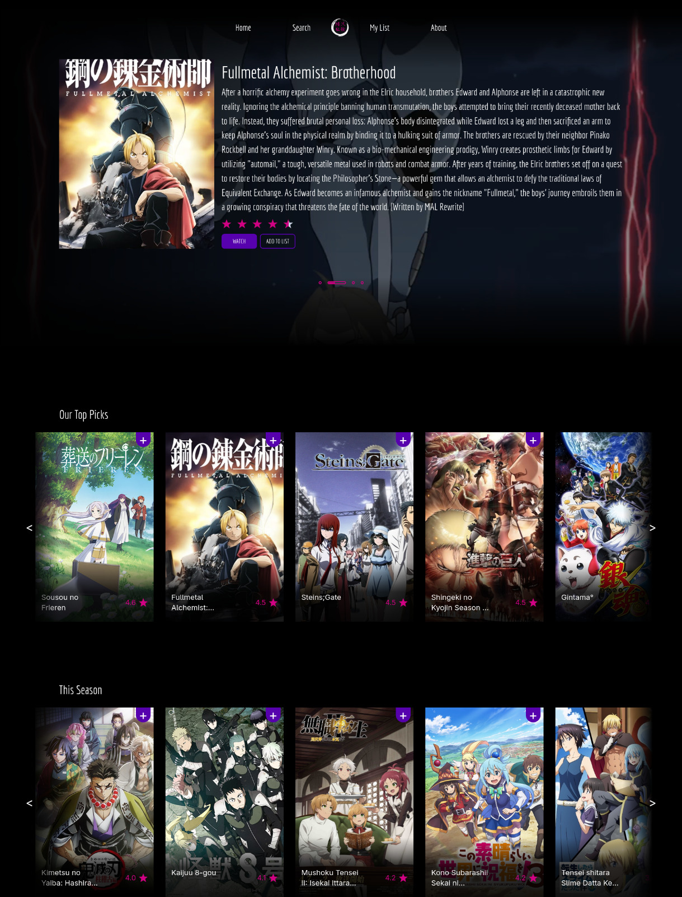
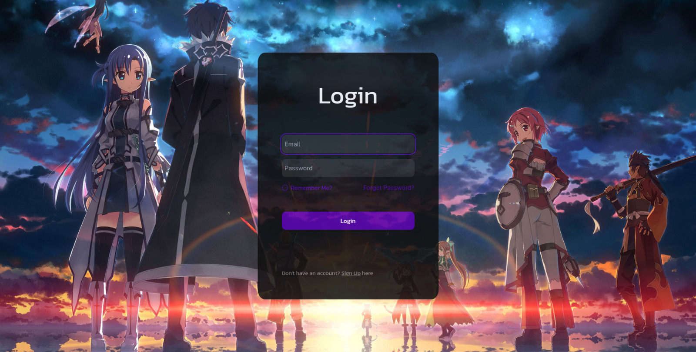
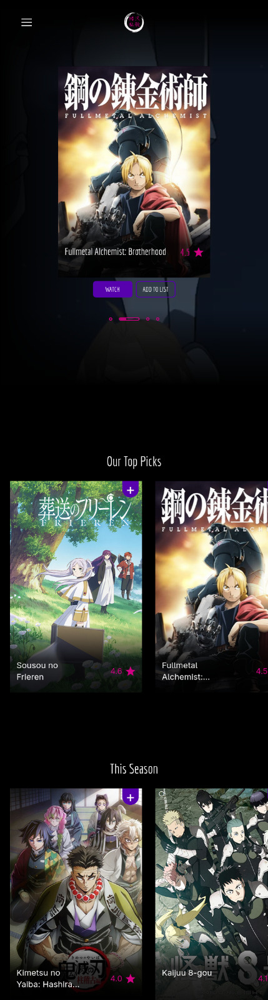
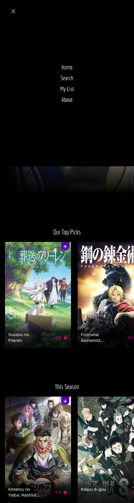
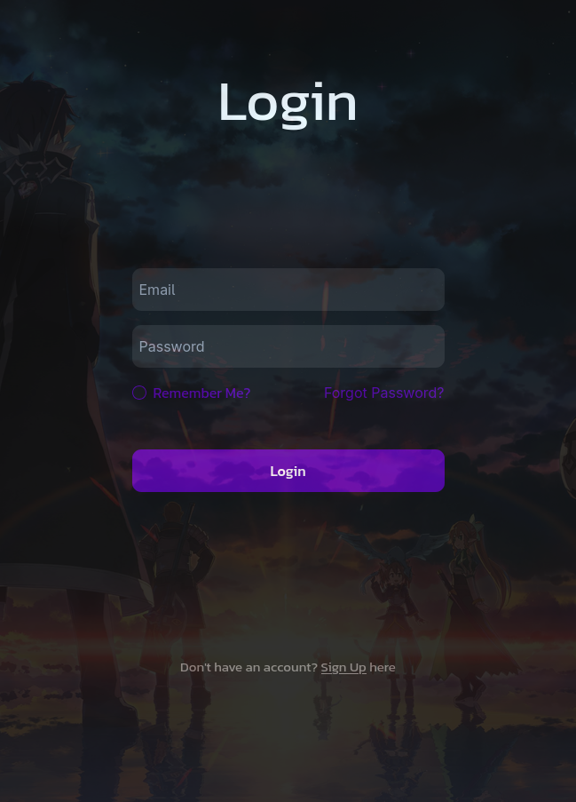

<div align="center">
  
  
  <h1>OtakuShikaku</h1>
  
  **Discover your next favorite anime through intelligent recommendations**
</div>

## About

OtakuShikaku is an anime recommendation platform that leverages content-based filtering algorithms to suggest anime series based on your searches. Simply search for any anime, and discover similar shows with matching characteristics and themes.

## Features

- **Intelligent Recommendations**: Content-based filtering algorithm analyzes anime characteristics
- **Search & Discover**: Find anime and get instant similar show suggestions  
- **Responsive Design**: Seamless experience across desktop, tablet, and mobile devices
- **Secure Authentication**: JWT-based auth system with encrypted password storage
- **Clean UI**: Modern, anime-themed interface built with React

## Screenshots

### Desktop Views
<div align="center">
  
  
</div>

### Mobile Views  
<div align="center">
  
  
  
</div>

## Tech Stack

### Frontend
- **React.js** - Modern UI framework
- **Redux** - State management with async actions
- **Responsive CSS** - Mobile-first design approach

### Backend  
- **Flask** - Lightweight Python web framework
- **JWT Authentication** - Secure token-based auth
- **Content-Based Filtering** - Recommendation algorithm

### Database
- **MySQL** - Relational database for user data and anime information

## Architecture

```
otakuShikaku/
├─ backend/                  # Backend server
│  └─ otakushikaku/
│     ├─ Blueprints/         # API routes
│     ├─ preprocessing/      # Data preprocessing logic
│     ├─ requirements.txt    # Python dependencies
│     ├─ main.py            # Application entry point
│     └─ .env               # Environment variables
│
└─ frontend/                 # Frontend React app
   └─ otakushikaku/
      ├─ public/             # Static assets
      ├─ package.json        # Node dependencies
      └─ src/                # React source code
         ├─ Actions/         # Redux/Thunk async actions
         ├─ Assets/          # Fonts and images
         ├─ Components/      # Reusable UI components
         ├─ Screens/         # Full-page screens
         └─ State/           # Redux slices / global state
```

## Setup & Installation

### Prerequisites
- Python 3.8+
- Node.js 14+
- MySQL database

### Backend Setup

1. Navigate to the backend directory:
```bash
cd backend/otakushikaku
```

2. Create and activate virtual environment:
```bash
python -m venv venv
source venv/bin/activate  # On Windows: venv\Scripts\activate
```

3. Install dependencies:
```bash
pip install -r requirements.txt
```

4. Configure environment variables in `.env`:
```env
DATABASE_URL=your_mysql_connection_string
JWT_SECRET_KEY=your_secret_key
FLASK_ENV=development
DEBUG=True
```

5. Run the Flask server:
```bash
python main.py
```

### Frontend Setup

1. Navigate to the frontend directory:
```bash
cd frontend/otakushikaku
```

2. Install dependencies:
```bash
npm install
```

3. Start the development server:
```bash
npm start
```

The application will be available at `http://localhost:3000`

## Environment Variables

The backend requires the following environment variables in `.env`:

| Variable | Description |
|----------|-------------|
| `DATABASE_URL` | MySQL database connection string |
| `JWT_SECRET_KEY` | Secret key for JWT token generation |
| `FLASK_ENV` | Flask environment (development/production) |
| `DEBUG` | Enable/disable debug mode |

## How It Works

1. **User Registration/Login**: Secure authentication with encrypted passwords
2. **Search Anime**: Users can search for any anime title
3. **Get Recommendations**: Content-based filtering analyzes anime features (genre, studio, year, etc.)
4. **Discover Similar Shows**: Algorithm suggests anime with matching characteristics and themes

---

<div align="center">
  
  
  **Happy anime watching!**
</div>